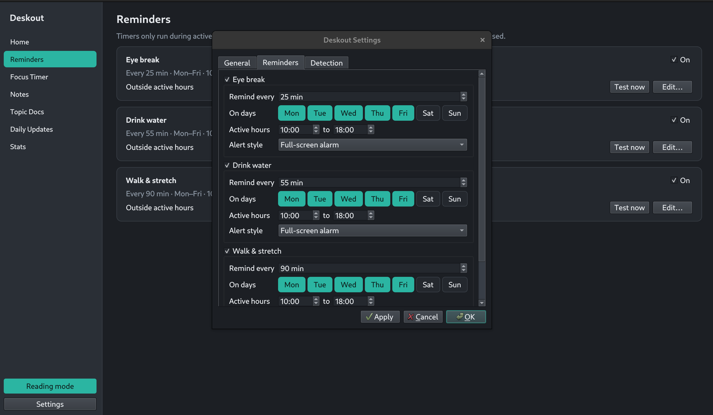
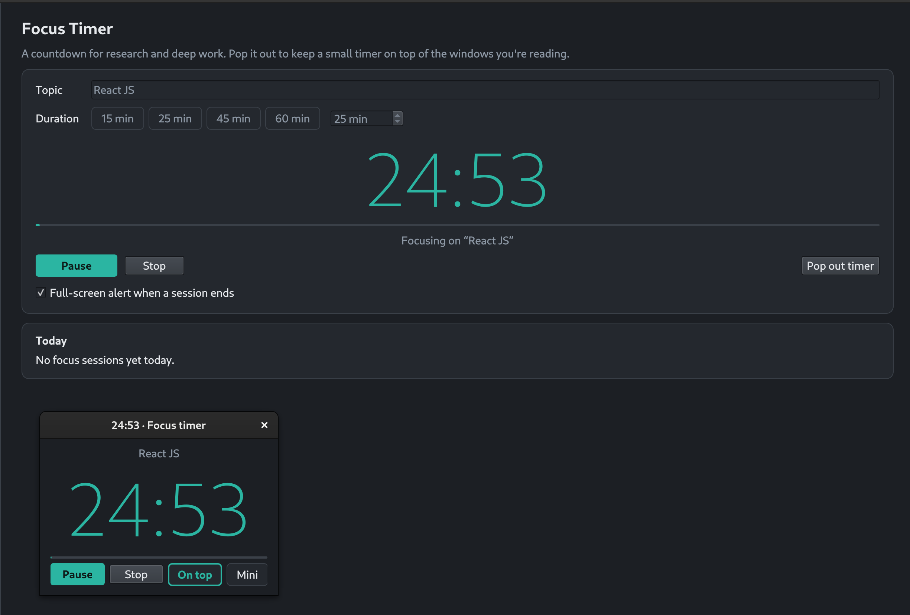
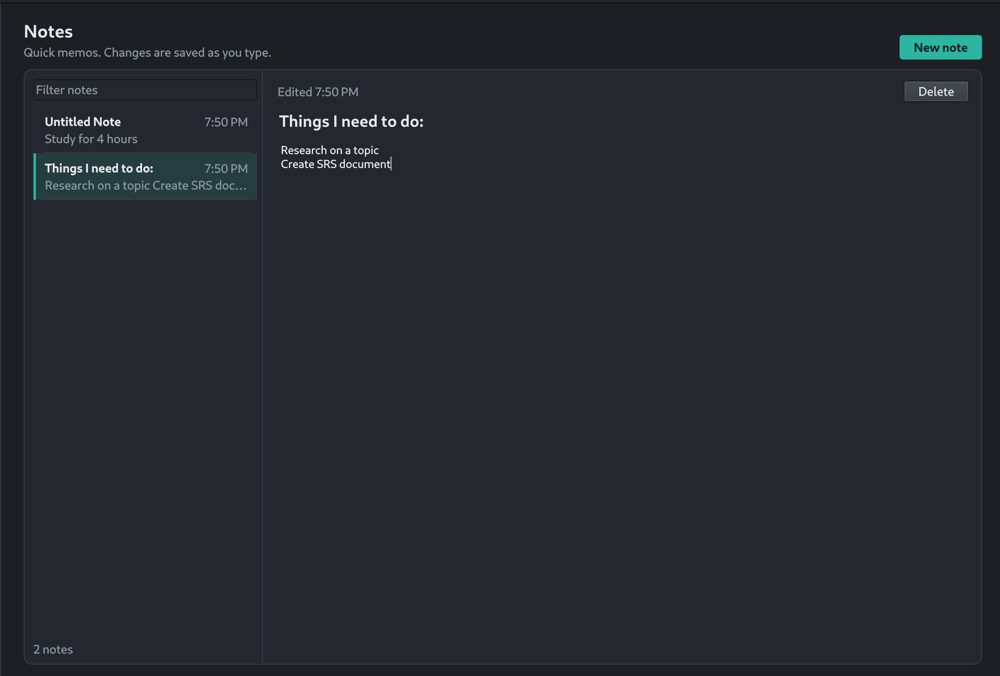
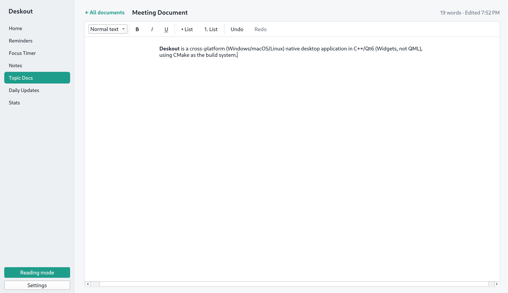
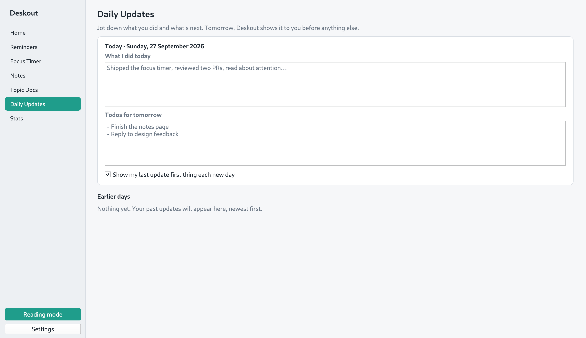
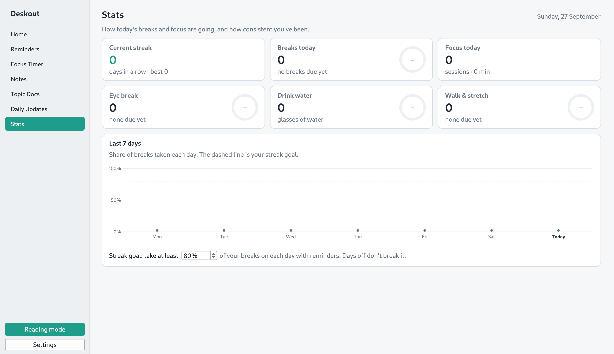

# Deskout

A desktop wellness and focus app for Windows, macOS and Linux, built with C++17 and Qt 6.

Deskout lives in the system tray. It reminds you to rest your eyes, drink water and stretch, and gives you a quiet place for focus sessions, notes, documents and daily updates.

## Download

Get the latest version for Windows, macOS or Linux :

## Reminders

Eye break, drink water, and walk and stretch reminders. Each one has its own interval, active days and active hours, and can show as a full-screen alarm or a simple notification. Eye breaks come with short guided eye exercises.

## Focus Timer

A countdown for research and deep work, 25 minutes by default. Pop it out into a small window that can stay on top of everything else.

## Notes

Quick memos with a filterable list. Changes are saved as you type.

## Topic Docs

A simple document editor with headings, bold, italic, underline and lists. Documents are listed in one place and can be renamed at any time.

## Daily Updates

Write what you did today and what is next. The next day, Deskout shows it to you before anything else.

## Stats

Breaks taken today, focus sessions, your current streak and a chart of the last 7 days.

## Also included

- Reading mode that turns the whole screen grayscale
- Global shortcut to pause all reminders (Ctrl+Alt+P by default)
- Reminders pause while you are away from the keyboard
- Alarms switch to a notification when another app is full screen or you are in a call
- Optional start on login
